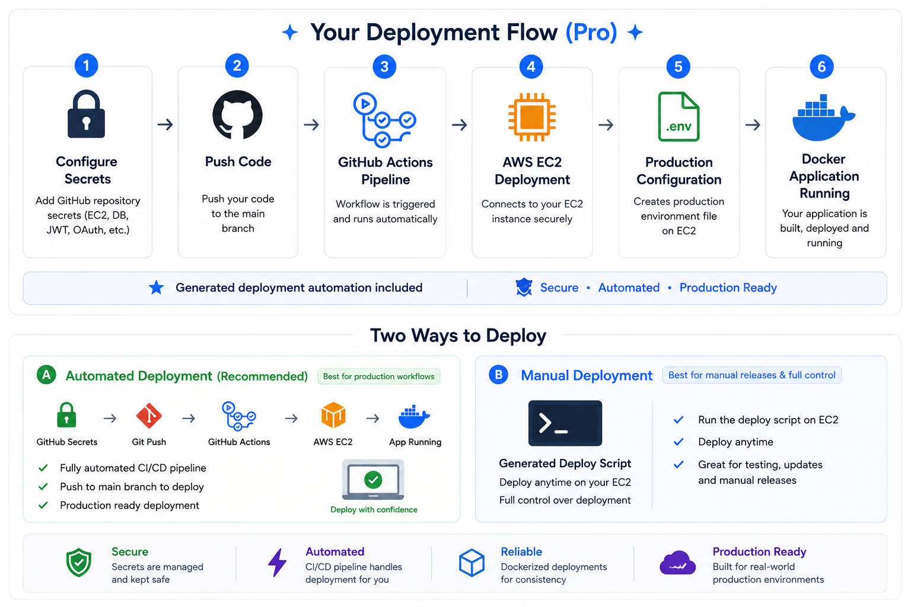
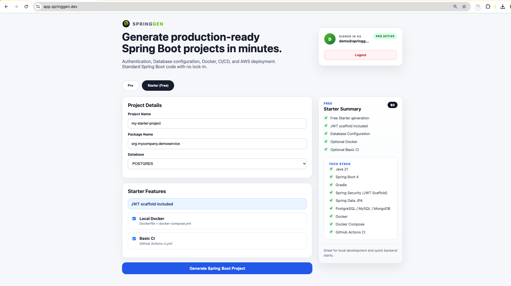
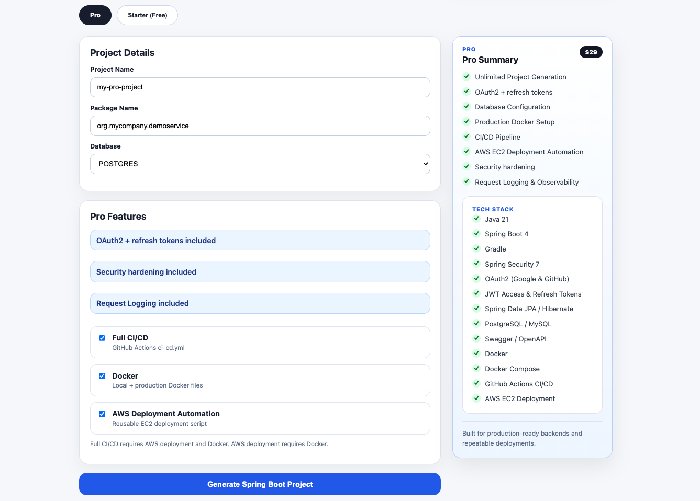
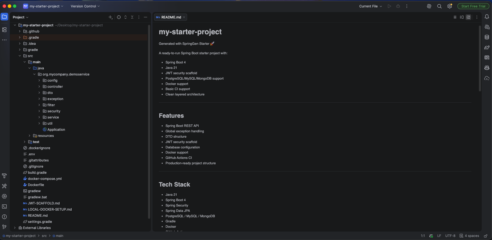
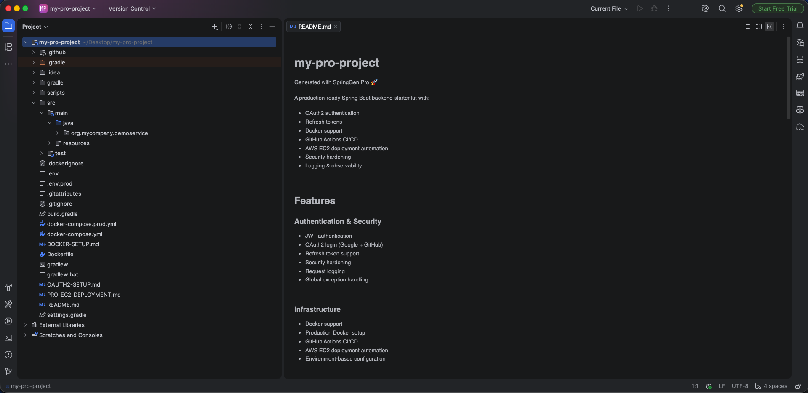

# SpringGen — Generate Spring Boot Backends in Minutes 🚀  [](https://www.npmjs.com/package/springgen) [](LICENSE)

Generate production-ready Spring Boot backends instantly — Authentication, Database, Docker, CI/CD, and AWS EC2 deployment included.

👉 **[Try Free via CLI](#try-springgen-free-starter-cli)** •
🚀 **[Upgrade to Pro](https://app.springgen.dev)**

---

## What is SpringGen?

Every new backend service starts the same way — same structure, auth setup,
database config, security hardening, Docker, and CI/CD pipeline. Most developers rebuild this
from scratch or copy-paste from a previous project every single time.

SpringGen is built around that repeated workflow. Whether you are a freelancer spinning up a new client backend,
a founder building an MVP, or a developer starting another microservice — run the CLI or web UI, get a
consistent production-ready backend, and start writing business logic.

No copy-pasting. No forgotten configs. No "how did I set this up last time."

SpringGen uses a deterministic template/module engine to assemble
tested Spring Boot project structures, configurations, and production-ready components.

---

## 🎥 Demo — Spring Boot + Docker + GitHub Actions + AWS EC2

See SpringGen generate and deploy a production-ready Spring Boot application in minutes.

<p align="center">
  <a href="https://www.youtube.com/watch?v=FoQvdnamsqs">
    
  </a>
</p>

In this demo:

✅ Generate a Spring Boot project  
✅ Run locally with Docker Compose  
✅ Configure GitHub Actions secrets  
✅ Push code to trigger CI/CD  
✅ Automatically deploys to AWS EC2  
✅ Verify production health endpoint

---

## How is SpringGen Different?

### vs Spring Initializr

Spring Initializr gives you a project foundation — dependencies, build files, and a basic application entry point.

SpringGen starts where Initializr stops:

- Layered architecture with controllers, services, repositories
- DTO patterns and global exception handling
- Database configuration
- Authentication setup (JWT, OAuth2)
- Production security configuration
- Docker, CI/CD, and AWS deployment configuration

Initializr helps you start a Spring Boot project.

SpringGen helps you start a production-ready Spring Boot backend.

### vs JHipster

JHipster is a full-stack generator — frontend, backend, and ongoing project management through its ecosystem. Powerful if you want a complete application platform with built-in conventions.

SpringGen generates a standard Spring Boot project and then gets out of the way:

- No frontend opinions
- No generator runtime dependencies
- No custom framework APIs
- No new ecosystem to learn

After generation, the code is yours — a normal Spring Boot application you can modify, deploy, and maintain however you want.

SpringGen sits between Initializr and JHipster:

> More structure than Initializr. Less ecosystem commitment than JHipster.

---

## Who is SpringGen For?

SpringGen is useful for developers who know Spring Boot but want to move faster.

Ideal for:

* Backend developers building SaaS products
* Freelancers starting new client projects
* Startup founders creating MVP backends
* Engineers building multiple microservices
* Developers who want consistent project structure across projects
* Java/Spring developers who prefer writing business logic over repeating setup

SpringGen may not be ideal for:

* Developers looking for a Spring Boot learning tutorial
* Teams with existing internal platform templates
* Engineers who prefer manually configuring every project from scratch
* Projects requiring highly customized enterprise architecture from day one

---

## 🚀 SpringGen Pro — Production Ready

Stop rebuilding the same production setup for every Spring Boot project.

SpringGen Pro unlocks unlimited Spring Boot backend generation — create as many projects as you need with authentication, database, security, deployment, and DevOps configuration ready to go.

**Pay once. Generate unlimited production-ready Spring Boot projects.**

### ⚙️ Interactive Project Generator UI

Choose:

- Package name
- Production Database (PostgreSQL, MySQL)
- Docker setup
- CI/CD
- Authentication (OAuth2 + refresh tokens)
- Logging
- AWS deployment options


### 🔐 OAuth2 + Refresh Tokens

Generate production-ready Spring Security:

- Google OAuth2 login
- GitHub OAuth2 login
- JWT access tokens
- Refresh token flow
- Persistent user storage
- Persistent refresh tokens
- Sample secured endpoints
- Swagger API Testing

### 🐳 Production Docker Setup

Includes:

- Dockerfile
- docker-compose.yml
- docker-compose.prod.yml
- Environment configuration
- Health checks


### 🚀 CI/CD → AWS EC2 Deploy

Push code.

GitHub Actions automatically:

- Builds your application
- Creates production configuration
- Connects to EC2
- Deploys your Docker application


### 🖥️ Generated EC2 Deploy Script

Deploy anytime with a ready-to-use script.

Generated:

```text
scripts/deploy-ec2.sh
```

Handles:

- Docker builds
- Application updates
- Container cleanup
- Restart policies
- Resource limits

Use it through GitHub Actions or run manually on EC2.


### 🛡️ Security Hardening

Includes:

- CORS configuration
- Security headers
- Request filtering
- Stateless JWT authentication
- Protected endpoints
- Production-focused security structure

### 📊 Logging & Observability

Includes:

- Request logging for API calls
- Request ID tracing across application logs
- Structured `key=value` console logs
- Production-ready logging levels
- Docker and cloud-friendly log output

---

## AWS EC2 Deployment Automation



SpringGen Pro supports two deployment workflows:

### Automated Deployment

```text
GitHub Secrets
   ↓
Git Push
   ↓
GitHub Actions
   ↓
EC2
   ↓
Docker Application Running
```

Best for production workflows.


### Manual Deployment

Use the generated deploy script on EC2

```bash
# 1. One-time setup
nano .env.prod

# 2. Deploy anytime
git pull origin main
./scripts/deploy-ec2.sh
```

Best for manual releases, testing, and full control over deployments.

---

## Unlock SpringGen Pro

Generate production-ready Spring Boot projects in minutes.

👉 https://app.springgen.dev

**$29 one-time launch pricing**

See more details : [PRO-FEATURES.md](./docs/PRO-FEATURES.md)

---

## Starter vs Pro

| Feature                                  |  Starter |                Pro |
|------------------------------------------|---------:|-------------------:|
| Price                                    |     Free | $29 launch pricing |
| Spring Boot structure                    |        ✅ |                  ✅ |
| Controller / Service / Repository layers |        ✅ |                  ✅ |
| DTO structure                            |        ✅ |                  ✅ |
| Global exception handling                |        ✅ |                  ✅ |
| JWT authentication scaffold              |        ✅ |                  ✅ |
| Database configuration                   |        ✅ |                  ✅ |
| PostgreSQL / MySQL support               |        ✅ |                  ✅ |
| MongoDB support                          |        ✅ |                  ❌ |
| Dockerfile                               |        ✅ |                  ✅ |
| Docker Compose local setup               |        ✅ |                  ✅ |
| Basic GitHub Actions CI                  |        ✅ |                  ✅ |
| OAuth2 authentication                    |        ❌ |                  ✅ |
| Refresh token flow                       |        ❌ |                  ✅ |
| Production configuration                 |        ❌ |                  ✅ |
| AWS EC2 deployment automation            |        ❌ |                  ✅ |
| Full CI/CD deployment workflow           |        ❌ |                  ✅ |
| Logging and observability setup          |        ❌ |                  ✅ |
| Security hardening                       |        ❌ |                  ✅ |

---

## Try SpringGen Free (Starter CLI)

The Starter edition is free and available through the CLI.

It is designed for:

* Local development
* MVP projects
* Backend scaffolding
* Learning project structure
* Quickly starting Spring Boot APIs

### Install

```bash
npm install -g springgen
```

### Generate a Project

```bash
springgen init my-app --db=postgres
```

### Supported Databases (Starter)

```bash
--db=postgres
--db=mysql
--db=mongo
--db=none
```

### Run the Generated Project

Configure your environment — update `.env` values before running.

```bash
cd my-app
./gradlew bootRun
```

Or run with Docker:

```bash
docker compose up --build
```

The application starts at:

```text
http://localhost:8080
```

---


## How It Works


```text
CLI or UI sends project configuration
↓
SpringGen backend validates requested tier
↓
Generator engine builds project dynamically
↓
Starter or Pro modules are applied
↓
ZIP project is generated
↓
User downloads and runs the project
```
---
## Example Generated Project Structure

```text
my-app/
├── src/main/java/com/example/
│   ├── controller/
│   ├── service/
│   ├── repository/
│   ├── dto/
│   ├── entity/
│   ├── config/
│   ├── security/
│   ├── filter/
│   ├── exception/
│   └── Application.java
│
├── src/main/resources/
│   ├── application.yml
│   └── application-prod.yml          # Pro
│
├── Dockerfile
├── docker-compose.yml
├── docker-compose.prod.yml           # Pro
│
├── .github/workflows/
│   ├── ci.yml
│   └── cd.yml                        # Pro
│
├── scripts/
│   └── deploy-ec2.sh                 # Pro
│
├── .env
└── .env.prod                         # Pro
```

---
## Screenshots

### Generate Starter Projects



Generate free Spring Boot Starter projects with:

- JWT scaffold
- Docker setup
- Database configuration
- Basic CI

---

### Generate Pro Projects



Generate production-ready Spring Boot projects with:

- OAuth2 authentication
- Refresh tokens
- AWS deployment automation
- CI/CD
- Security hardening

---

### Starter Generated Output



---

### Pro Generated Output



---

## Authentication Notes

Starter includes a lightweight JWT scaffold for development and demonstration purposes.

Pro includes production-focused authentication support with:

* OAuth2 login
* JWT access tokens
* Refresh tokens
* Persistent user and token entities

For more details, see:

```text
docs/JWT-SCAFFOLD.md
docs/PRO-FEATURES.md
```

---

## Documentation

Available documentation:

```text
docs/
├── CLI-USAGE.md
├── STARTER-JWT-SCAFFOLD.md
├── STARTER-DOCKER-SETUP.md
├── PRO-FEATURES.md
└── FAQ.md
```
### Pro Documentation

SpringGen Pro generated projects include additional production guides:

- AWS EC2 deployment guide
- OAuth2 + refresh token setup
- Production configuration guide
- CI/CD deployment instructions

Available inside generated Pro projects.

---

## 📚 Articles & Guides

Technical deep dives behind the problems SpringGen helps automate:

- [How to Structure Spring Boot Projects Beyond Spring Initializr](https://dev.to/yadrs/how-to-structure-spring-boot-projects-beyond-spring-initializr-fac)
- [Spring Boot Authentication Beyond the Basics — OAuth2, JWT, and Refresh Tokens in Production](https://medium.com/p/f897fbfeb72a)
- [Dockerizing Spring Boot for Local and Production Environments — The Setup You’ll Rebuild Every Time](https://dev.to/yadrs/dockerizing-spring-boot-for-local-and-production-environments-the-setup-youll-rebuild-every-time-5dn7)
- [Deploying Spring Boot to AWS EC2 with Docker and GitHub Actions — The Repeatable Way](https://dev.to/yadrs/deploying-spring-boot-to-aws-ec2-with-docker-and-github-actions-the-repeatable-way-55bi)
- [AWS EC2 vs ECS for Spring Boot Deployment — When Should You Use Which?](https://dev.to/yadrs/ec2-vs-ecs-for-spring-boot-deployment-when-should-you-use-which-30ld)
- [GDPR Compliance in a Spring Boot App — The Implementation Nobody Talks About](https://dev.to/yadrs/gdpr-compliance-in-a-spring-boot-app-the-implementation-nobody-talks-about-1j40)

---

## Examples

Example resources:

```text
examples/
├── screenshots/
│
│   # UI
│   ├── starter-generator-ui.png
│   ├── pro-generator-ui.png
│
│   # Generated outputs
│   ├── generated-starter-project.png
│   └── generated-pro-project.png
│
└── generated-structure.md
```

## SpringGen Editions

SpringGen provides a free Starter generator and a paid Pro upgrade.

* Starter is free.
* Pro is a one-time purchase.
* SpringGen does not provide consulting, freelancing, or custom software development services.
* Pro access unlocks premade automated project generation features.

---

## 🗺 Roadmap

Planned future improvements:

### Developer Experience
- IntelliJ IDEA plugin
- More project customization options
- Additional Spring Boot modules

### Infrastructure & Deployment
- Terraform support
- AWS CloudFormation support
- Amazon ECS deployment support
- Advanced CI/CD templates

### Team & Scale Features
- Multi-module workspace generator
- API Gateway service generation
- Shared infrastructure templates
- Multi-environment support (dev/staging/prod)
- Database migrations with Flyway
- Advanced logging, metrics, and observability modules

---

## Support

For support, 

contact: 📧 [support@springgen.dev](mailto:support@springgen.dev)

Website:
🌐 https://app.springgen.dev

---

## Repository Scope

This public repository contains SpringGen documentation, examples, screenshots, and preview versions of the Starter CLI/npm client.

The preview CLI projects are provided for transparency and local exploration.

The production SpringGen backend, web application, billing integration, deployment infrastructure, Pro templates, and commercial generation modules are maintained privately.

The published npm package and hosted SpringGen platform are operated from the private production repository.

---

## License

The public SpringGen documentation, examples, and preview CLI clients are released under the MIT License.

SpringGen Pro templates, premium modules, deployment infrastructure, backend services, and commercial generation features are proprietary and are not included under this license.

See:

LICENSE

---

## ⭐ Support the Project

If this helped you:
   * Star this repo
   * Share with other developers

---

## One-Line Summary

Generate Spring Boot backends instantly — from local setup to production deployment foundations.
